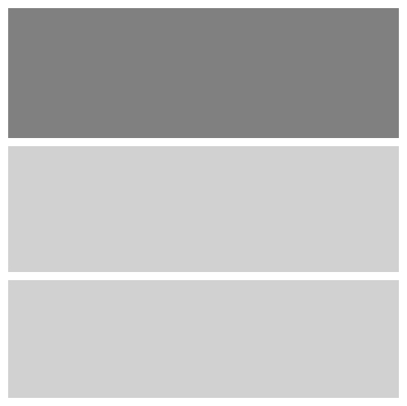

#CSL: CSS Smart Layout

## So, what the heck is this thing?

It stands for: CSS Smart Layout, neato huh?  
It is a CSS layout framework based on the fabulous, maybe tricky <a>Flex-box</a> thing, I bet you've heard about it, if not just click the link, but damn it don't forget to come back to the damn page. Anyways, I also made the framework based in the most common layouts used in web design and tried my best to make it intuitive as hell, so that's pretty much it.

## Why in hell did I bother?

Well, I tried a couple of css frameworks out there and while they're pretty sweet, I needed something simpler with no extra bits, I think is pretty cool you gotta try it, geez the most simple layout just uses one single class and that's it, you have a nice responsive layout which you don't have to worry about adding extra classes for when it reaches smaller screens, check the freaking <a>Demo</a> if you don't believe me.

## And how on earth does this thing work?

Ok, so the framework is pretty damn simple, you put your layout containers inside a parent element to which you will apply the layout class and switches as you need.

In case you need a more deeper explanation this is how you should do it, you start by creating an HTML element which we will call _PARENT_ it could be a div, section, etc. Now to this _parent_ you add a csl class like _csl-2-fourth or csl-3-third_, depending on what class you're using you need to add the number of elements which will act as your layout columns, the _CSL_ class in the _parent_ will set the behavior of your layout across the different view ports, but there's other pretty cool classes I call switches that help you to manipulate your layout to your needs, I'll include a couple of informative and very professional drawings so you can see what I mean.

The following example shows a graphic representation of how you can manipulate one single layout across devices with a few css classes.

This behavior is possible using the _SWITCHES_: csl-reverse, csl-start-*, csl-stop-*, csl-wrap-*, csl-flipwrap. I will go over these in the [Demo page](demo.html).

## Class Anatomy

Now a little bit of "Anatomy" so you can remember the classes easily, let's take the following class _csl-2-fourth_ for example:  
There are 3 parts, the first one is just like an identifier, so don't worry about it.  
The second one is the number of columns your layout must have, in this case is _2_.  
And the third part is the width of the first column based on its parent container, in this case 1/4, so I'm just using the denominator _fourth_, BOOM there you have it!  
What? The second column?  
Well the other column takes the remaining space available, easy huh?

Wait what? what about a 3 columns layout?

Ok, let's do one more _csl-3-third_:  
So with this class we have 3 columns and the first one is 1/3 right?  
Now the other 2 columns get distributed equally... so you have first, second and third column with a width of 1/3.

Now, I ain't typing more examples, I'll show you with more pofessional graphics... boxes, so you can see it, but before, let's get to some rules _yeah!!_

## The freaking rules

The first rule is:  
**BREAKPOINTS:** There are 4 breakpoints at 1219px, 989px, 769px and 549px, remember these numbers, and don't whine about it, they're just 4 numbers.

Second rule:  
**YOU CAN NEST!** Hell yeah son!, just keep in mind that when resizing the browser, the nested layouts will change based on the width of the document not its parent, I know you're smart but it doesn't hurt to mention it.  
So _IF_ using a _Switch class_ does not help you to achieve the layout you need, remember you can nest!

Fourth rule...  
I honestly have no idea what other rule could there be, so I'll leave you with the little boxes, I'll go get a beer, I'll check on you at the demo page, Cheers!

And yeah I just skipped Third rule on purpose... and yeah, there's no third rule either.